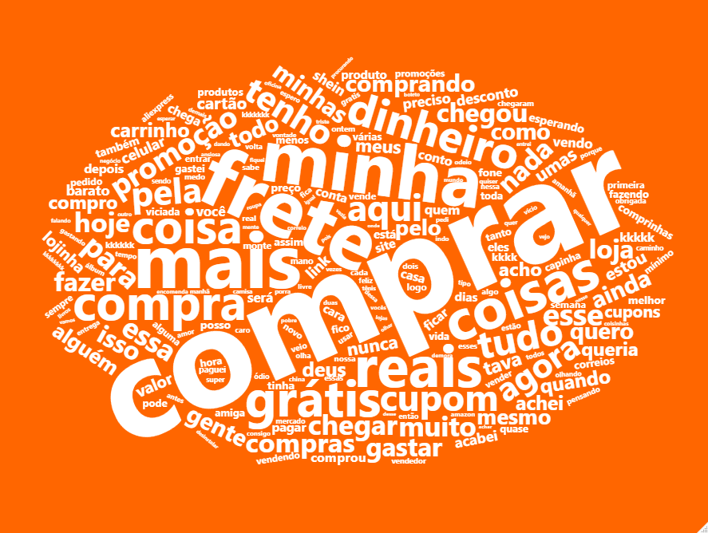

# Sobre
A shopee é uma plataforma de comércio eletrônico sigapurence fundada em 2015 e vende diversos produtos.

Dia 07/07 a shopee lançou uma promoção onde distribuiu cupons de frete grátis sem valor minimo e também ofereceu descontos em diversos produtos vendidos por vendedores locais e chineses. A partir disso, criei uma nuvem de palavras com os tweets comendando e citando a Shopee
### Carregando pacores necessários
```{r pacotes, message=FALSE, warning=FALSE}
library(rtweet)
library(tidyverse)
library(tidytext)
library(wordcloud2)
```

### Coletando os tweets que contenha a palavra _Shopee_.
```
# 20.000 ou quase, tweets pela manhã do dia 07/07
rt <- search_tweets("Shopee",
                    lang = "pt-br", #lingua
                    n = 20000,# quantidade
                    include_rts = FALSE,
                    retryonratelimit = TRUE
    )

save(rt, file = "shopee.Rdata")

```

### Carregando o arquivo e limpando texto
```{r carregando, warning=FALSE,message=FALSE}
load("shopee.Rdata")

# Tirando simbolos dos textos
rt$text <- gsub("https\\S*", "", rt$text) 
rt$text <- gsub("@\\S*", "", rt$text) 
rt$text <- gsub("amp", "", rt$text)
rt$text <- gsub("[\r\n]", "", rt$text)
rt$text <- gsub("[[:punct:]]", "", rt$text)

# limitando para apenas um tweet por usuario
txt <- distinct(rt, user_id, .keep_all = TRUE)
```

### Tratando os textos para plotagem
```{r}
# criando vetor de texto
palavras <- txt %>%
  select(text) %>%
  unnest_tokens(word,text)

# Contando a frequencia de cada texto
palavras_freq <- palavras %>% count(word, sort=TRUE)


# filtrando para as palavras maiores
tweets <- palavras_freq %>% filter(nchar(word) > 3,
                                   word != "shopee", #outlier
                                   n > 100)

```

### Plotando
```
# plotando, e salvando manualmente
wordcloud2(tweets,color = "white", backgroundColor = "#FF6600")
```

### Resultado
```{r}

```
